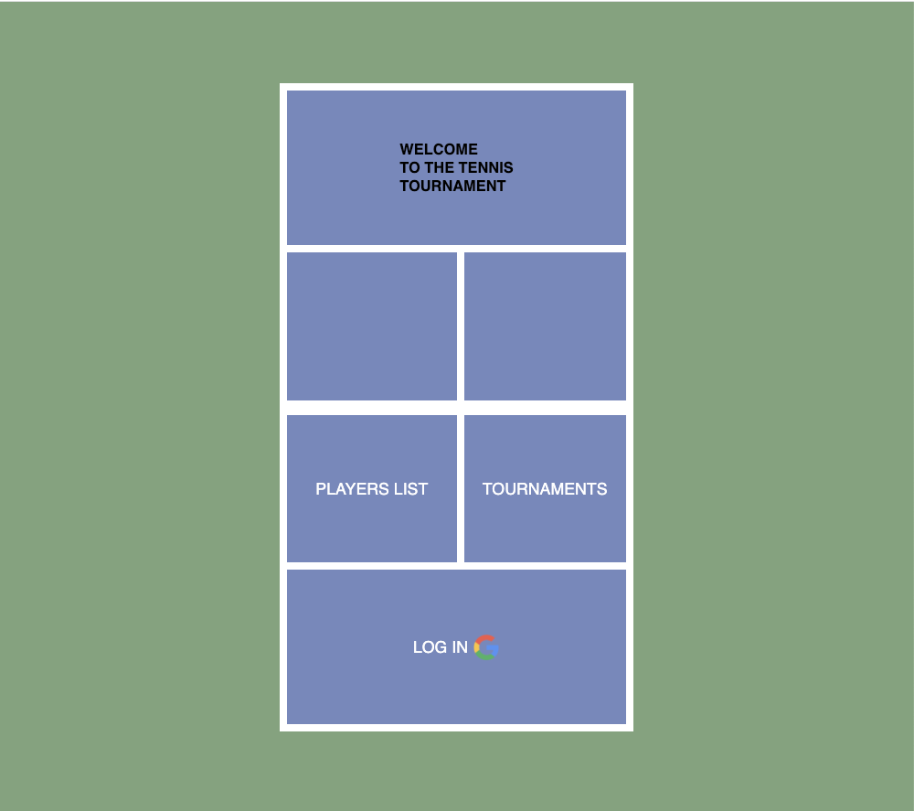
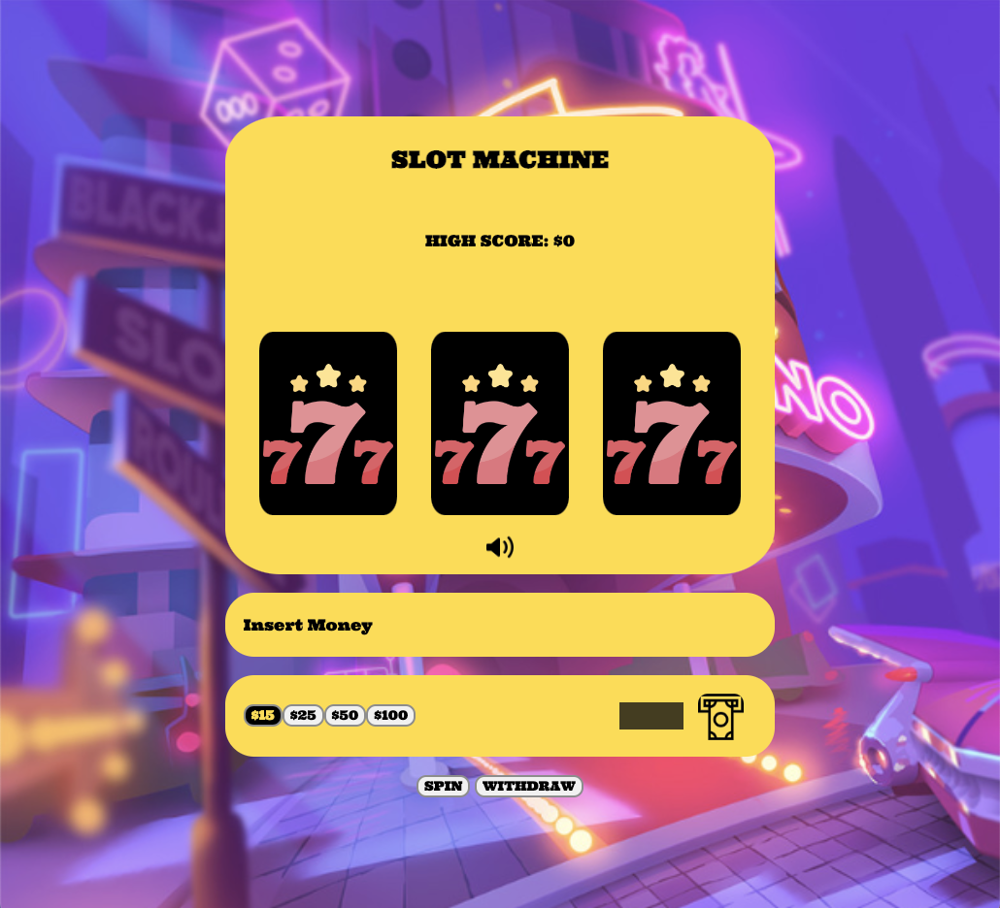

<table>
<tr>
<td>
  I am a dedicated software engineer who recently relocated from Korea to pursue an exciting career in the field. With a background in the military, I have learned the value of teamwork and communication, enabling me to thrive in collaborative environments. Outside of work, I lead and captain a tennis team, demonstrating my leadership and team-building skills. I am a people person who enjoys connecting with others and building genuine relationships. My passion lies in web development, where I focus on creating innovative and user-centric solutions.
</td>
</tr>
</table>

## I've worked with:

### Skills/Tools:

| Skills     |            |
| ---------- | ---------- |
| React      | NodeJs     |
| JavaScript | Express    |
| Bootstrap  | MongoDB    |
| HTML5      | CSS3       |
| Django     | Heroku     |
| Python     | Django     |
| Git        | PostgreSql |

### Software

| Software       |
| -------------- |
| VS Code        |
| REST Framework |

# Projects

## [Rent A Car](https://github.com/kkyeongrokk/Rent-A-Car)

### Django/Python/PostgreSQL based Full Stack Group Project

Rent-a-Car is a user-friendly and efficient web application designed to simplify the process of renting cars. Whether you're a frequent traveler, a business professional, or someone in need of temporary transportation, Rent-a-Car offers a seamless experience for renting vehicles of all types.

### Check it out deployed here : [Rent A Car](https://rentacar-49bf66d5f4a6.herokuapp.com/)

  

## [My Tennis Tournament](https://github.com/kkyeongrokk/tennis-tournament)

### Mongoose/Express/Node based Full Stack Project.

My Tennis Tournament is a web app that tennis clubs can use to organize tournaments in their own clubs. Players who want to play in the tournament can register themselves for the upcoming tournaments. Being able to track score and the result of the matches, clubs will have successful tournaments.

### Check it out here : [My Tennis Tournament](https://my-tennis-tournament.herokuapp.com/)

 

## [Slot Machine](https://github.com/kkyeongrokk/slot-machine)

### HTML, CSS, and JavaScript based Front End Project

This is an implementation of slot-machine. You can experience playing slot machine game at home without going to casino or spending money.

### Check it out here : [Slot Machine](https://kkyeongrokk.github.io/slot-machine/)

 

## Portfolio/Contact

Email [kyeong@evergreen.edu](mailto:kyeong@evergreen.edu)\
[LinkedIn](https://www.linkedin.com/in/kyeongrok-kim-dev/)
